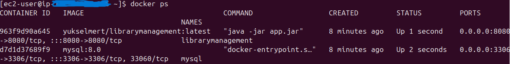
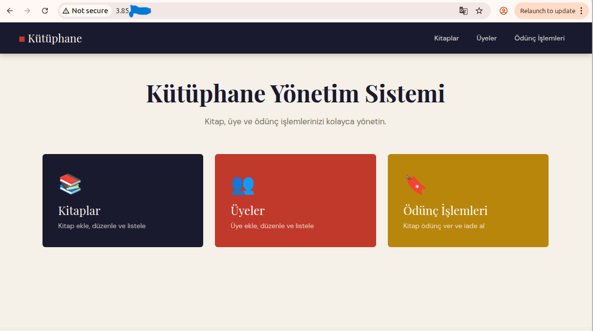

# 📚 Library Management System – Spring Boot 4

## 📌 Project Overview
This project is a full-stack web application built using **Java 25, Spring Boot 4, and Gradle 9**.
It simulates a **Library Management System** where users can manage members, books, and borrowing operations.
Deployed on AWS EC2 with Docker, Docker Compose, and Nginx reverse proxy configuration.
The system supports both:
- Web-based interface (Thymeleaf)
- REST API endpoints (for Postman testing)

## 🛠️ Technology Stack
- Java 25
- Spring Boot 4
- Gradle
- MySQL
- Spring Data JPA
- Thymeleaf
- REST Controllers
- Docker & Docker Compose
- AWS EC2
- Nginx
- Postman (API testing)

## 🚀 Features

### 👤 Member Management
- Create, Read, Update, Delete members

### 📖 Book Management
- Create, Read, Update, Delete books

### 🔄 Borrow System
- Members can borrow books
- Database JOIN operations used to fetch related data
- Relational mapping via JPA

### 🌐 Web Interface
- Server-side rendered pages using Thymeleaf

### 🔌 REST API
- Separate REST controllers for Postman testing

## 🏗️ Architecture
Client (Browser / Postman) -> Controller -> DTO Layer -> Service -> Repository (JPA) -> MySQL Database

Web Layer: Thymeleaf (Server-side rendering)
API Layer: REST Controllers (JSON responses)

## 🐳 Docker Architecture
The application and MySQL database run as separate Docker containers managed by Docker Compose.

Internet → EC2 Public IP (Port 80) → Nginx → App Container (Port 8080) → MySQL Container (Port 3306)

### 🔨 Build
```bash
./gradlew bootJar
```

### 🚀 Run with Docker Compose
```bash
docker-compose up -d
```

Application runs at: http://localhost:8080

## 🐳 DockerHub
[yukselmert/devops-1](https://hub.docker.com/r/yukselmert/devops-1)

## ☁️ Deployment Architecture (AWS EC2 + Nginx + Docker)
The application is containerized with Docker and deployed on AWS EC2.
Nginx acts as a reverse proxy forwarding public traffic to the Docker container.

### 🚀 Deployment Steps
1. Connect to EC2 using SSH.
2. Pull the image and start containers:
```bash
docker-compose up -d
```

### 🌍 Reverse Proxy Configuration
Nginx forwards public HTTP traffic to the Spring Boot container:

Internet → EC2 Public IP (Port 80)
Nginx → localhost:8080 (Docker Container)

Users access the system via:
http://<EC2_PUBLIC_IP>

## 🧪 How to Run (Local Development)

1️⃣ Configure MySQL in `application.properties`

2️⃣ Build project:
```bash
./gradlew bootJar
```

3️⃣ Run with Docker Compose:
```bash
docker-compose up -d
```

Application runs at: http://localhost:8080

## 📦 Database
Relational structure includes:
- Member
- Book
- Borrow (Join entity)

Uses JOIN queries and JPA relationships.

## 🧠 Learning Outcomes
- Spring Boot layered architecture
- RESTful API design principles
- Thymeleaf server-side rendering
- JPA entity relationships and mappings
- SQL JOIN operations
- Gradle build lifecycle management
- Docker containerization
- Docker Compose orchestration
- AWS EC2 deployment
- Nginx reverse proxy configuration

## 📷 Deployment Proof

### 🐳 Docker Containers Running


---

### 🌍 Application Running on AWS EC2


---

### 🔁 Nginx Reverse Proxy Configuration

